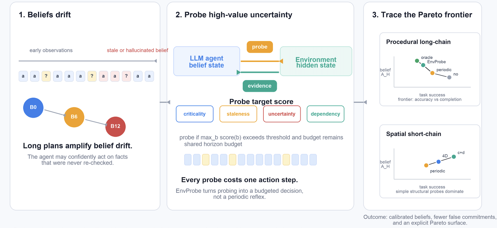

<div align="center">

<h1>EnvProbe</h1>

<p><b>When should long-horizon LLM agents actively query the environment?</b></p>

<p>
  <a href="#quick-start"></a>
  <a href="#method"></a>
  <a href="#benchmark"></a>
  <a href="LICENSE"></a>
</p>

<p>
  <a href="#citation"></a>
  <a href="#reproducing-results"></a>
  <a href="requirements.txt"></a>
</p>

</div>

<p align="center">
  
</p>

EnvProbe is the official research code for studying **environment probing as a control problem** in long-horizon LLM agents. The central question is simple: when an agent's internal belief may be stale, uncertain, or hallucinated, should it spend the next step acting, or should it first ask the environment for evidence?

The benchmark treats probe actions as costly. A probe improves belief calibration, but it consumes the same finite horizon as task actions. This makes hallucination reduction a budgeted decision rather than a free retrieval call.

## Highlights

- **Closed-loop belief calibration.** Agents maintain structured beliefs and can issue local probes against the environment state while planning.
- **Budget-aware probe selection.** `envprobe_simple` scores candidate beliefs using criticality, staleness, uncertainty, and dependency role.
- **Three controlled worlds.** EnvProbe covers spatial state tracking, graph navigation, and long-chain procedural tool dependencies.
- **Paper-scale registry.** `cells_registry.csv` defines paired seeds, stress regimes, method roles, and reproduction layers.
- **Main reported finding.** The 4D score improves belief accuracy by **+11.76 pp** over Periodic-Probe on the Stage-D setting, while revealing an accuracy/success Pareto trade-off on long-chain procedural tasks.

## Method

EnvProbe selects which belief to verify by scoring each candidate belief:

```text
score(b) = criticality(b)
         + staleness(b)
         + (1 - confidence(b))
         + dependency_role(b)
```

If the best score exceeds the threshold and probe budget remains, the method probes the corresponding environment fact; otherwise, the agent acts. This makes the method sensitive to both epistemic risk and task structure.

The key implementation lives in:

- `src/methods/envprobe_simple.py` for the 4D scoring rule and ablations.
- `src/methods/envprobe_simple_cd.py` for the criticality + dependency variant.
- `src/environments/` for the three simulated worlds.
- `src/metrics/scorer.py` for belief accuracy, dependency accuracy, self-check, and task success metrics.

## Benchmark

| Environment | Belief regime | Task family | Horizon |
| --- | --- | --- | --- |
| `ObjectStateWorld` | Spatial state | Find and pick up a goal object in a locked-room world. | 30 |
| `GraphNavWorld` | Spatial graph | Navigate to a target node through locked edges and keys. | 30 |
| `ToolDAGWorld` | Procedural dependencies | Execute a chain of tools to derive a target variable. | 30 |

All worlds expose the same environment interface: `reset`, `step_task_action`, `step_probe_action`, `get_observation`, `get_gold_state`, `available_task_actions`, and `available_probe_actions`.

## Methods

| Method | Probe policy |
| --- | --- |
| `no_probe` | Always acts; never queries the environment. |
| `random_probe` | Randomly probes a valid probe target. |
| `periodic_probe` | Probes every fixed interval. |
| `self_uncertainty_probe` | Probes when the agent reports low confidence. |
| `envprobe_simple` | Scores beliefs with criticality, staleness, uncertainty, and dependency role. |
| `envprobe_simple_cd` | Uses only criticality and dependency role. |
| `envprobe_simple_minus_{c,s,u,d}` | Leave-one-dimension-out ablations. |
| `envprobe_judge` | Uses an LLM judge to decide probe versus act. |
| `oracle_probe` | Selects the belief with the largest belief-vs-gold mismatch. |
| `oracle_task_weighted` | Oracle variant weighted by task progress. |

## Quick Start

```bash
cd envprobe
python -m venv .venv
source .venv/bin/activate
pip install -r requirements.txt
```

Run offline sanity checks that do not require an API key:

```bash
python src/scripts/anchor_3_determinism.py
python src/scripts/anchor_4_oracle_self_check.py
```

Run a small LLM smoke test:

```bash
export OPENAI_API_KEY=...

python -m src.scripts.run_smoke \
  --envs ObjectStateWorld ToolDAGWorld GraphNavWorld \
  --stress S2 \
  --methods no_probe periodic_probe envprobe_simple \
  --episodes 1 \
  --prefix smoke
```

Outputs are written to `experiments/`.

## Reproducing Results

The registry file defines each experimental cell, including environment, stress regime, method, seed range, and role.

```bash
# 50-seed gate-A pilot across all three worlds.
python -m src.scripts.run_main \
  --registry cells_registry.csv \
  --layer gate_a \
  --prefix gate_a_pilot \
  --parallel 5 \
  --gate-a

# Stage-D main cells from the paper registry.
python -m src.scripts.run_main \
  --registry cells_registry.csv \
  --layer r3_stage_d \
  --prefix r3_stage_d \
  --parallel 8

# Full spine-primary sweep, n=220 paired seeds per cell.
python -m src.scripts.run_main \
  --registry cells_registry.csv \
  --layer spine_primary \
  --prefix spine_S2 \
  --parallel 8
```

Each run produces step-level JSONL logs, episode-level metrics, error logs, and checkpoint files under `experiments/`.

## Repository Layout

```text
envprobe/
|-- assets/
|   `-- envprobe_intuition.png
|-- examples/
|   |-- reproduce_main.sh
|   `-- smoke_test.sh
|-- src/
|   |-- agents/          # LLM prompts, parser, and agent wrapper
|   |-- environments/    # ObjectStateWorld, GraphNavWorld, ToolDAGWorld
|   |-- methods/         # Probe policies, ablations, and oracle baselines
|   |-- metrics/         # Step-level and episode-level scoring
|   |-- scripts/         # Runners, anchors, verification utilities
|   |-- tests/           # Regression and invariant tests
|   `-- utils/           # API client and JSONL logging
|-- cells_registry.csv
|-- config.yaml
|-- requirements.txt
|-- LICENSE
`-- README.md
```

## Extending EnvProbe

To add a new world, subclass `src.environments.base.Environment` and implement the task action, probe action, observation, and gold-state methods.

To add a new probing method, subclass `src.methods.base.Method` and implement `decide(ctx) -> MethodDecision`.

To add a new metric, extend `src.metrics.scorer.score_step` or `src.metrics.scorer.score_episode` and include the field in the JSONL record.

## Citation

```bibtex
@misc{envprobe2026,
  title  = {EnvProbe: When LLM Agents Should Actively Probe the Environment},
  author = {Anonymous Authors},
  year   = {2026},
  note   = {Manuscript in preparation}
}
```

## License

This project is released under the MIT License. See `LICENSE`.
